# Silfable Project Reference

> **Single source of truth for product, architecture, implementation status, operations, and Mainnet acceptance.**
>
> Update this document in the same change set whenever a venue, execution boundary, provider, configuration requirement, or production claim changes. Historical documents have intentionally been consolidated into this file to avoid contradictory status claims.

**Last reviewed:** 2026-08-03  
**Repository:** `silfable-web`  
**Primary product:** Electron desktop runtime; web workspace is a separate wallet-connected surface.  
**Network policy:** Mainnet only. Development/test networks are not exposed in the product UI.

## 1. Product definition

Silfable is a guarded AI-assisted capital runtime. The AI can understand a request, prepare a typed contract, obtain provider evidence, explain risk, and present the relevant review. It is **not** a signing authority and it never turns a chat response into a transaction by itself.

Every mutating action follows this sequence:

```mermaid
flowchart LR
  U[User request] --> A[AI / deterministic intent parser]
  A --> C[Typed mission or venue contract]
  C --> Q[Fresh provider quote or build]
  Q --> S[Unsigned preflight / simulation]
  S --> G[Policy + fee + allowlist gates]
  G --> F[Explicit final approval]
  F --> K[Local signer]
  K --> B[One broadcast attempt]
  B --> R[Persisted receipt + reconciliation]
```



If any step fails, the default is **fail closed**: no signature, no broadcast, and a readable error that identifies the failed boundary.

## 2. Repository map

| Area | Location | Responsibility |
|---|---|---|
| Desktop UI | `apps/desktop/src/renderer/src` | Onboarding, workspace, review cards, settings, receipts, confirmation modals. |
| Desktop main process | `apps/desktop/src/main` | IPC, vault, wallet custody, quotes, preflight, policy, signing, broadcast and encrypted persistence. |
| Desktop preload | `apps/desktop/src/preload` | Narrow renderer-to-main IPC API. Renderer must not gain Node, signing, secret, or direct privileged access. |
| Shared contracts | `packages/contracts/src` | Schemas, request/response types and IPC contracts. |
| Web | `apps/web` | Landing/docs/release pages and wallet-connected web workspace. Web wallet signs through the browser wallet; it does not receive desktop vault secrets. |
| Cloud worker | `apps/cloud-worker` | Cloud proposal/monitoring infrastructure only. It must not hold a desktop private key or gain autonomous broadcast authority. |
| Scripts | `scripts` | Build, evidence and acceptance helpers. |

## 3. Trust and security boundaries

### Desktop

- A master password unlocks a local encrypted vault.
- Solana and EVM private keys stay in the local main process; renderer and AI only receive non-secret addresses and typed results.
- IPC validates trusted sender, parses shared schemas and requires an unlocked vault for privileged methods.
- Every real broadcast requires the exact reviewed contract, fresh preflight, explicit confirmation string, password recheck, kill-switch check and one broadcast attempt.
- A timed-out or unknown broadcast is reconciled by transaction signature/order. It must never be blindly re-broadcast.
- Secrets, API keys and RPC URLs are encrypted locally; logs and receipts must not expose them.

### Web

- The connected browser wallet is the only signing authority.
- The web application must request a wallet signature for each transaction; it does not use the desktop master password or accept a user private key.
- API settings are configuration only and never grant signing/broadcast authority.

### AI and cloud

- AI output is advisory until converted to a typed contract and accepted by deterministic policy.
- Cloud monitoring may wake, propose and notify. It cannot silently sign or broadcast.
- “Full Access” in the current product means a bounded, revocable local grant for registered tools; it is not unrestricted unattended capital deployment.

## 4. User surfaces and flows

### 4.1 Desktop startup

1. Application runs a system check.
2. First use: guided setup creates the vault, wallets, integrations, agent settings and provider configuration.
3. Returning use: unlock screen asks for the existing master password. “Set up a new vault” requires a destructive acknowledgement and does not recover the old vault.
4. The workspace loads persistent sessions, wallets, encrypted receipts and portfolio evidence after unlock.

### 4.2 Desktop setup and settings

The setup wizard and the Settings review use the same saved configuration. After setup, Settings opens the review surface, where each category can be edited and returned to review. It must not re-run first-run onboarding.

| Section | Purpose |
|---|---|
| Security | Local encrypted vault and master-password lifecycle. |
| Wallets | Generate/import Solana and EVM wallets; select a primary wallet; copy public address. Secret material is never shown after import. |
| Integrations | Solana RPC, Jupiter API key, optional Tavily and managed Pinata/IPFS configuration where applicable. |
| EVM configuration | Chain-scoped RPC override, quote-provider configuration and transaction bounds. A valid override must prove the expected chain and serve a current block. |
| Agent core | Context/output limits, temperature and bounded subagent tuning. |
| Provider | OpenRouter/provider credential and selected model. |
| Transaction settings | Default slippage/deadline/priority and fee caps. These are the source of session defaults. |

### 4.3 New session and workspace

New session chooses a wallet/chain workspace and a mode. It does **not** authorize a transaction. The session determines which lane is available:

| Workspace | Available work |
|---|---|
| Solana | Jupiter swaps, Token Launch Studio, Solana-source bridge, positions/activity. |
| EVM | Chain-scoped swap and EVM-source bridge review, positions/activity. |
| General | Read-only planning, research and non-chain-specific work. |

Modes:

- **Agent:** interactive, one task/conversation at a time.
- **Mission:** goal-driven persistent lifecycle with plan, constraints, stop conditions and recoverable state.
- **Restricted:** default permission. Every capital-moving action requires final approval.
- **Guarded Full Access:** a bounded/revocable grant for approved mission tools. It remains policy, limit and kill-switch constrained and is not a blanket bypass of custody controls.

The workspace has three columns: session navigation at left; chat/contracts/receipts in the center; portfolio/positions, activity, runtime/cost and session details at right. Portfolio is context-sensitive: with no active session it shows configured wallet evidence; with a session it shows the session wallet/chain position.

## 5. Venue status and production claims

Status terms:

- **Verified Mainnet acceptance:** a controlled live transaction was completed and independently reconciled.
- **Implemented, release-gated:** code and safety boundary exist, but a live acceptance test and release evidence are still required.
- **Preview/read-only:** may quote, analyze, or build a draft; it cannot make a production execution claim.
- **Unavailable:** not implemented or deliberately blocked.

### 5.1 Current venue matrix

| Lane | Current implementation | Verified evidence | Production status |
|---|---|---|---|
| Solana Jupiter swaps | Typed quote, unsigned transaction build, allowlist, simulation, fee guard, password/final approval, one-attempt broadcast, receipt reconciliation. | Controlled SOL→USDC and USDC→SOL Mainnet swaps completed and finalized. | **Verified restricted swap lane.** Keep per-release acceptance and monitoring. |
| Solana arbitrary Jupiter pairs | Works only for valid Jupiter-routable mint pairs and only after provider quote + program allowlist + fee guard. | JUP test demonstrated fee/rent guard can block unsafe economics. | Restricted; route/token-dependent. Not a promise for every token. |
| Pump.fun Token Launch | Local draft, managed Pinata/IPFS immutable metadata, ephemeral mint signer, create-v2 preflight, final checks, local signing, receipt. | Controlled Mainnet token launch completed/finalized and visible on Pump.fun. | **Verified restricted token-launch lane.** Token trading/buy/sell automation is separate and not implied. |
| Pump.fun/PumpSwap assisted trading | Legacy analysis/pilot UI and risk concepts exist. | No production trading acceptance. | **Not production-enabled.** |
| Solana→EVM bridge | Dynamic relay/deBridge-compatible route contract, quote, source simulation, policy, final approval, source receipt and reconciliation. | Solana USDC→Robinhood USDG controlled source broadcast completed; provider reported fulfillment, while destination hash may be absent from provider response. | **Conditional/reconciliation-required.** Do not call fully production-complete until destination receipt/amount is independently reconciled for supported. |
| EVM Bridge (EVM → Solana & EVM → EVM) | Typed relay architecture, EVM engine, source simulation/execution and encrypted receipts are implemented. | TERUJI BERHASIL (AiService dan RelayEvmBridgeService terhubung, EVM Bridge tool berfungsi). | **Verified Mainnet acceptance.** |
| EVM multi-chain swaps | Chain registry, provider adapters, typed quote/build, preflight/allowlist, signer, execution receipt and recovery structure. | No complete EVM Mainnet swap acceptance. Robinhood quote reliability is under active infrastructure validation. | **Implemented, release-gated.** |
| Robinhood EVM swap | Robinhood Chain ID 4663; official RPC with public fallback; Uniswap adapter is pinned because Kyber may not index USDG. | Controlled ETH→USDG and USDG→ETH Mainnet swaps completed and finalized. | **Verified restricted swap lane.** Keep per-release acceptance and monitoring. |
| Other EVM chains | Ethereum, Base, Arbitrum, Optimism, Polygon, BNB Chain and Avalanche registry support. Kyber is primary on supported chains. | Per-chain production acceptance pending. | **Release-gated.** |
| Hyperliquid | Restricted proposal/preflight structure. | No Mainnet execution acceptance. | **Release-gated.** |
| Jupiter Trigger/limit order | MVP lifecycle and receipt structures exist. | No controlled Mainnet end-to-end acceptance recorded. | **Release-gated.** |
| DCA, TP/SL, scheduled missions | Persistent lifecycle/strategy structures exist. | No independently accepted autonomous execution. | **Not production-enabled.** |
| Guarded Full Access | Grants, constraints, revocation and local policy boundaries exist. | No unrestricted autonomous capital execution claim. | **Guarded only.** |

### 5.2 Mainnet results already recorded

These are evidence of controlled functions, not a blanket approval for unrelated routes or tokens:

1. **SOL → USDC Jupiter swap:** finalized, with a persisted receipt and Solana Explorer confirmation.
2. **USDC → SOL Jupiter reverse swap:** finalized, with expected/actual output and fee receipt.
3. **Pump.fun Token Launch:** metadata uploaded to Pinata/IPFS; unsigned `create_v2` preflight passed; final authorization/broadcast finalized; token page visible on Pump.fun.
4. **Solana USDC → Robinhood USDG bridge:** source transaction was submitted, and the destination wallet balance was observed. The provider did not return a destination transaction hash, so the receipt must remain `relay-pending`/reconciled based on independent destination evidence rather than being falsely labelled fully finalized.
5. **Robinhood EVM Swap:** Controlled ETH→USDG and USDG→ETH swaps completed; exact approvals for Swap Proxy verified; transactions submitted and independently reconciled.

## 6. Solana execution details

### Jupiter swap flow

1. Select a registered Solana wallet and request a specific amount/pair.
2. Resolve canonical mints (native SOL uses `So11111111111111111111111111111111111111112`; native USDC uses `EPjFWdd5AufqSSqeM2qN1xzybapC8G4wEGGkZwyTDt1v`).
3. Fetch a fresh **quote-only** Jupiter response. If it fails, show no fabricated output/fee/simulation data.
4. Build typed mission contract: mints, raw amount, slippage, deadline and wallet.
5. Validate pair, amount, deadline, wallet registration, finalized balance and quote-only evidence.
6. Request unsigned transaction; inspect signer, programs and allowlist.
7. Simulate. Display compute, network/priority fee, rent/account funding, total wallet outflow and fee guard outcome.
8. If passed, show final approval modal. User enters master password, exact confirmation phrase and acknowledgement.
9. Sign locally and broadcast once. Persist signature before reconciliation.
10. Reconcile confirmed/finalized state, actual input/output, fee, account funding, slippage, slot and explorer link. Refresh portfolio.

### Fee guard

The UI separates input token amount from network fee and account funding. It calculates fee in lamports, SOL, estimated USD and percentage of the requested input value, then classifies it as reasonable/high/extreme. A blocked simulation must not permit execution. Do not loosen a limit merely to make a test pass without reviewing why the route is expensive.

## 7. Pump.fun Token Launch details

### Product scope

Pump.fun in Silfable is a **token creation** lane. It is not an AI auto-buy/auto-sell/PumpSwap trading promise.

### Metadata flow

1. User opens **Token Launch Studio** from a Solana session.
2. User provides name, symbol, description and an image. A normal image is required for a useful Pump.fun listing; do not use copyrighted or misleading material.
3. Desktop uploads image and JSON through the managed Pinata/IPFS path. User does not enter the Pinata JWT in the UI.
4. App receives an immutable `ipfs://...` metadata URI and shows a draft. This step never creates a chain transaction.
5. Run unsigned `create_v2` Mainnet preflight. It creates an ephemeral/non-extractable mint signer only in volatile main-process memory and discards it on expiry/lock.
6. Show network fee, priority fee, account rent, total estimate, expiry and all policy checks.
7. Run final checks, then require password, exact confirmation phrase and acknowledgement.
8. Broadcast once; persist/reconcile the receipt. The UI must show actions to open Solana Explorer and the Pump.fun coin page after a finalized launch.

### Typical token-launch economics

The launch cost comes chiefly from required account rent plus network/priority fee; it is not the market price of the new token. Initial purchase is optional and must be separately displayed. Market cap/price shown by Pump.fun after launch comes from the bonding-curve market, not from the metadata upload itself.

## 8. Bridge details

### Contract fields

Every bridge review must record source/destination chain and asset, source amount, recipient, minimum destination amount, total provider fee, source network fee, deadline/expiry, timeout/refund policy and provider order ID.

### Lifecycle

1. User selects source wallet/asset and destination recipient/asset.
2. Router discovers a supported provider route; no route is invented if quote data is absent.
3. Verify source balance, chain, recipient, provider fee and minimum destination amount.
4. Build and simulate the exact source transaction.
5. Final approval requires exact source/destination confirmation, password, acknowledgement and fresh preflight.
6. Broadcast **one** source-chain transaction.
7. Store source signature/order immediately.
8. Reconcile source confirmation, provider relay status and destination transaction/settlement.
9. If provider reports fulfillment without a destination hash, mark the receipt pending/reconciliation-required. Never rebroadcast merely because status is unknown.

### Economics

Cross-chain liquidity/relayer fees can dominate a small transfer. A 1 USDC route may have a fixed provider cost that makes it unsuitable for execution even if the source network fee is tiny. The fee floor and maximum total fee are intentionally enforced. Change them only when the displayed expected/minimum output is economically acceptable.

### Route support policy

Route availability is provider- and liquidity-dependent, not a permanent promise that every chain-to-chain pair is executable. The dynamic router must confirm the exact source chain, destination chain, token mapping and provider build on every request. Robinhood support is accepted only when the provider route and corresponding EVM RPC are fresh and verified.

## 9. EVM swap and Robinhood policy

### Supported EVM model

- An EVM session is bound to one selected EVM wallet and chain.
- Swapping is **within the selected EVM chain**. Example: Robinhood USDG → native ETH is a Robinhood-chain swap; it is not a bridge.
- Moving assets from Solana to Robinhood/Base/Arbitrum/Ethereum is a **bridge**, then a separate EVM swap may happen on that destination.
- Multi-chain registry: Ethereum, Base, Arbitrum One, Optimism, Polygon, BNB Chain, Avalanche C-Chain and Robinhood Chain.

### Provider policy

- KyberSwap is the primary adapter for its supported EVM chains.
- Uniswap-compatible adapter is available as a separately allowlisted route. Robinhood is currently pinned to Uniswap because Kyber does not reliably index every Robinhood asset such as USDG.
- Provider selection does not replace the chain RPC. A quote may come from a router API, while EVM chain ID, block, allowance, gas estimate, simulation and receipt must come from a healthy verified RPC.

### Robinhood Chain troubleshooting

Robinhood Chain is chain ID **4663**. Default behavior is official RPC first, then approved public fallback. An endpoint is usable only if it returns both the correct `eth_chainId` and a fresh `eth_blockNumber`.

If a quote fails with an error mentioning `eth_blockNumber`, it is an RPC availability issue—not a wallet signing or Uniswap approval issue. Retry after restarting the desktop app. For production reliability, configure a dedicated HTTPS RPC endpoint in Settings; it is encrypted locally and validated for chain ID and current-block availability before saving. Never put an RPC key in a chat, receipt or source-controlled `.env` file.

## 10. Mission, automation, Full Access and portfolio

### Durable mission runtime

Mission state persists locally with its plan, lifecycle, constraints, stop conditions, proposals and receipts. It may pause/resume/recover while the runtime is active. A persistent record does not grant a persistent signing authority.

### Automation

DCA, TP/SL and scheduled observations are constrained strategies/proposals. They must have spending limits, deduplication, expiration, stop conditions, reversible pause/revoke controls and durable receipts. Until each venue has a documented Mainnet acceptance, they are not allowed to autonomously broadcast.

### Guarded Full Access

Full Access is deliberately narrower than VEX-style permission: grants bind a mission, capability set, wallet, limit and expiry, can be revoked, and remain subject to venue gates, policy, emergency stop and signer custody. It is never “AI can do anything without review.”

### Portfolio

Current desktop portfolio can show configured/session wallet balances, Solana token balances, recent chain activity, stored receipts, runtime cost, session context and scoped EVM readings. The quality of EVM data depends on a healthy verified RPC. Multi-chain PnL, historical cost basis and price provenance are evidence-scoped; do not label them comprehensive without verified sources.

## 11. Relationship to VEX

Silfable takes architectural reference from the local VEX source under `D:\Web3\Vex`; VEX retains its own licence. This project does not copy VEX implementation.

### Shared principles

- Electron main-process custody boundary and narrow preload API.
- Local encrypted vault and master-password unlock.
- System check → setup → review → workspace flow.
- Agent/Mission separation, restricted permission, session persistence and receipts.
- EVM routing uses provider evidence plus a separately verified chain RPC.
- VEX's Robinhood default is `https://rpc.mainnet.chain.robinhood.com`, with optional per-chain `localChainRpcUrls` override.

### Important differences

| Area | VEX | Silfable |
|---|---|---|
| Solana launch | No Pump.fun token launch identified in the audited VEX lane. | Restricted Pump.fun token creation with Pinata/IPFS metadata and a completed controlled acceptance. |
| EVM venues | Kyber primary where supported; Uniswap is a classified fallback option. | Chain-specific Kyber/Uniswap adapters; Robinhood currently pins Uniswap due USDG indexing limitations. |
| Bridge | Broader provider/router abstraction and runtime-driven workflow. | Dynamic provider route contract, but live acceptance is still route-by-route. |
| Web workspace | Desktop/local-first emphasis. | Browser-wallet web workspace exists; desktop is the custody-heavy product. |
| Full permission | Can run registered mutating tools without per-tool prompt subject to its mission/policy model. | Guarded Full Access retains more explicit local limits/revocation and is not unattended execution. |

## 12. Current release blockers and priorities

### Must complete before a broad production claim

1. **Bridge reconciliation:** Verify destination transaction hash and actual destination settlement for each supported live route; document provider fallback and refund/timeout behavior.
2. **EVM acceptance:** Run controlled Mainnet quote → preflight → approval/allowance → swap → finalized receipt for at least one supported chain, then repeat Robinhood only after a stable dedicated RPC and valid router liquidity.
3. **Security review:** vault/private-key, IPC, program/router allowlists, logging/secrets, dependency and packaging/code-signing review.
4. **Recovery drill:** restart/lock/unlock after each receipt, reconcile an unknown-broadcast test, and prove that no duplicate broadcast occurs.
5. **Release evidence:** packaged Windows build, clean install/update behavior, signed binary/code-signing process and per-venue acceptance records.

### Deferred or not production enabled

- Pump.fun/PumpSwap automated trading, discovery-driven buying and token selection.
- Autonomous DCA, TP/SL and scheduled capital execution.
- Hyperliquid Mainnet trading.
- Unattended Full Access.
- Universal any-chain-to-any-chain bridge guarantee.
- General multi-chain PnL/history guarantee.

## 13. Controlled Mainnet acceptance checklist

### Universal rules

- Use a dedicated test wallet with only funds you can afford to spend.
- Record wallet, request, quote/build ID, provider, timestamp, chain/slot/block, signature/order, receipt and explorer URL.
- Start with the smallest amount that remains economically reasonable after fees.
- Never retry a timeout/unknown broadcast without reconciling the existing signature/order.
- Stop if a route, recipient, mint/contract, chain ID, fee, deadline, simulation, approval requirement or allowlist differs from the reviewed contract.

### Solana Jupiter swap

1. Read wallet and verify balances.
2. Prepare quote-only SOL→USDC using a small amount.
3. Confirm policy 7/7, expected/minimum output and quote expiry.
4. Simulate and require reasonable fee guard, valid program allowlist and expected account funding.
5. Final approve and execute one broadcast.
6. Verify finalized signature in Solana Explorer and app receipt.
7. Refresh portfolio, restart/lock/unlock app and verify receipt/balance persistence.
8. Repeat USDC→SOL reverse direction.

### Pump.fun token launch

1. Create non-production test metadata and upload an ordinary image through managed Pinata/IPFS.
2. Verify immutable metadata URI and preview it before any preflight.
3. Run unsigned create-v2 preflight; inspect mint, rent, total estimate, expiry and checks.
4. Refresh final checks directly before approval.
5. Approve one Mainnet launch broadcast.
6. Verify signature, mint and Pump.fun coin page; restart app and verify encrypted receipt.

### Bridge

1. Ensure source token balance plus source gas/network fee and a valid destination recipient.
2. Prepare a quote-only route with an economically realistic minimum output and maximum fee.
3. Inspect provider fee, expected/minimum destination amount, source/destination assets, order, expiry and refund/timeout policy.
4. Run unsigned source simulation; do not execute if fee/minimum is unacceptable.
5. Final approve and broadcast source once.
6. Verify source signature, provider order state and destination transaction/hash or independently verified destination balance.
7. Persist/reconcile a combined receipt. A missing destination hash must stay pending and must not be marked finalized merely because source succeeded.

### EVM swap

1. Select one EVM chain/wallet and use a dedicated RPC that passes chain ID + latest-block verification.
2. Request quote only for a liquid known pair with a small economically viable amount.
3. Verify provider/router, chain ID, token contracts/decimals, expected/minimum output, gas, approval spender and expiry.
4. If approval is required, review it as a separate, bounded action. Do not approve an unbounded/unrecognized spender.
5. Run exact unsigned simulation and router/program allowlist checks.
6. Final approve, sign once, broadcast once and reconcile explorer receipt.
7. Refresh EVM position and perform restart recovery test.

## 14. Build and verification commands

Run from repository root:

```powershell
npm.cmd run typecheck --workspace @silfable/desktop
npm.cmd run build --workspace @silfable/desktop
npm.cmd test --workspace @silfable/desktop
```

The desktop production build includes `audit-desktop-bundles.mjs`; it must pass before a packaged release is considered. Check repository-specific package scripts before adding new Next.js code; this repository uses a newer Next.js version with breaking conventions.

## 15. Coding rules

1. Keep renderer unprivileged. Add privileged behavior only in desktop main process behind typed IPC.
2. Use schemas from `@silfable/contracts` for new IPC/network boundaries.
3. Do not log private keys, master passwords, API keys, JWTs, full sensitive RPC URLs or raw secret input.
4. Never infer a quote, simulation, fee, receipt, token price or settlement that was not returned by a trusted source.
5. Any new router/program/provider needs an explicit allowlist, provenance, test and release gate.
6. Preserve one-attempt broadcast and explicit reconciliation semantics.
7. Update this document when behavior/status changes; do not create a new documentation island.

## 16. Update template

When updating this document, add an entry here with a short factual summary:

| Date | Change | Evidence / impact |
|---|---|---|
| 2026-08-03 | Robinhood RPC resolver now requires expected chain ID and fresh block read before it accepts a default, fallback or saved endpoint. | Prevents a node that answers only `eth_chainId` from being used for quote/preflight. Desktop typecheck and production build passed. |
| 2026-08-03 | Documentation consolidated. | This file supersedes prior phase, roadmap, VEX comparison and desktop acceptance documents. |
