# Silfable Venue Product Architecture

Last updated: 2026-07-28
Status: target product architecture. It does **not** enable a new signer, router, bridge, or broadcast path by itself.

## Product model

Silfable is organized by a wallet's network context and a typed action proposal,
not by a list of unrelated protocols.

| Product lane | User intent | Initial protocol | Current live state |
| --- | --- | --- | --- |
| Token Launch | Create and manage a new Solana token launch | Pump.fun | Restricted manual `create_v2` implementation; controlled Mainnet acceptance and security review pending |
| Solana Swap | Exchange existing Solana assets | Jupiter | Guarded restricted desktop swap path exists |
| EVM Swap | Exchange assets on one approved EVM chain | Uniswap-compatible verified deployment | Not implemented; reads and router readiness only |
| Bridge | Move an existing asset from one chain to another | Provider selected per route | Quote-only; signing and broadcast disabled |

Pump.fun is therefore **not a general trading workspace in the target product**. It is a launch venue: a user supplies launch parameters, Silfable prepares a launch proposal, deterministic services validate it, and the user explicitly approves the single launch transaction. PumpSwap is not a separate product lane. It may become relevant after a token migrates, but any future secondary-market trading belongs to the relevant swap lane rather than Token Launch.

## Non-negotiable safety rules

1. AI can explain, research, ask for missing values, and draft typed artifacts. It never chooses a token to buy, creates a token silently, signs, broadcasts, or treats a score as authorization.
2. Every mutable lane has its own deterministic policy, unsigned simulation, final revalidation, signer boundary, one-broadcast rule, independent receipt verification, and recovery procedure.
3. A venue is unavailable by default. A renderer setting, AI statement, provider response, or manual readiness boolean cannot open it.
4. There is no shared generic `execute` endpoint. A launch, Solana swap, EVM swap, and bridge each use a distinct typed contract and allowlist.
5. `Full Access` cannot bypass policy, simulation, wallet confirmation, spend limits, or the venue-specific signer gate.
6. Pump.fun launch must never include sniping, front-running, bundled execution, token impersonation, or an AI-selected launch without explicit user-supplied parameters.

## Target user flow

`New session` becomes an intent selector. The first choice is one of:

1. **Launch token** — Pump.fun token-creation workflow.
2. **Swap on Solana** — Jupiter route and swap workflow.
3. **Swap on EVM** — Uniswap-compatible route on one supported EVM chain.
4. **Bridge assets** — source-chain to destination-chain transfer workflow.
5. **Research** — no transaction capability; can inspect wallet and market evidence.

The selected intent is visible throughout the session and is immutable after creation. This prevents a research or launch session from silently becoming an EVM trade or bridge.

### Wallet-first implementation update (2026-07-28)

The intent-selector description above is the target action model, not the
current New Session UI. New desktop sessions now select and lock a wallet
network instead: Solana is available, while EVM remains disabled until its
dedicated vault and verified router are implemented. The user asks for a task
inside the session; a typed proposal, rather than the session itself, will
carry the immutable `pump-launch`, `solana-swap`, `evm-swap`, or `bridge`
intent. New Session does not set a per-session slippage cap: global Transaction
Settings remain the only safety-default source. Existing intent-tagged and
legacy Pump/PumpSwap sessions remain readable for compatibility only.

Every mutable intent follows the same lifecycle while retaining venue-specific validation:

```mermaid
flowchart LR
  A[User supplies exact parameters] --> B[AI drafts typed proposal]
  B --> C[Deterministic policy and allowlist]
  C --> D[Unsigned transaction build]
  D --> E[Simulation and fee/risk report]
  E --> F[Fresh final revalidation]
  F --> G[Explicit user approval]
  G --> H[Local signer or browser wallet signer]
  H --> I[One broadcast attempt]
  I --> J[Independent receipt verification and recovery]
```

Failure, timeout, stale simulation, unclear route state, unsupported chain, or missing allowlist results in **blocked**. The application never creates a synthetic transaction or retries an ambiguous broadcast automatically.

## Lane specifications

### A. Pump.fun Token Launch

**Purpose:** create a token; it is not an AI auto-buy or PumpSwap trading feature.

The current official creation surface describes immutable coin details, optional social links, optional SOL/USDC pairing and several optional product settings. Silfable currently models only the conservative draft subset: name, symbol, description, image URL, optional hosted metadata-JSON URL, social links, pairing, initial-purchase declaration, and explicit cost caps. The Pump SDK create path accepts a metadata URI, so an image URL alone is not sufficient to prepare a direct desktop creation transaction. It does not claim support for every website option merely because it is visible in the public UI. [Pump.fun creation page](https://pump.fun/create) states that coin data cannot be edited after creation; this is why the launch draft is immutable and requires an explicit acknowledgement.

Required user inputs are exact name, symbol, description, image/metadata URI, optional public links, creator wallet, initial-purchase decision/amount if supported by the official launch flow, maximum creation/initial-buy cost, maximum priority fee, deadline, and an irreversible-publication acknowledgement. The AI may draft copy but the user must confirm the final metadata exactly.

Deterministic launch checks must include official Pump.fun program/account bindings, metadata integrity and URI policy, wallet balance including rent and fees, exact lamport budget, allowed instructions/accounts, unsigned simulation, fresh state, and a complete receipt. Metadata upload has a separate content-policy and secret-handling boundary.

**Status:** restricted implementation complete in code; controlled Mainnet acceptance and external security review pending. The desktop has a strict launch-draft contract and a launch-specific path for the conservative SOL-paired, zero-initial-buy `create_v2` flow. Its production codec is local and dependency-minimal, with a test-only parity check against Pump SDK `1.36.0`. The preflight pins the official program and discriminator, exact creator/mint signer set, lookup-free v0 message, compute/priority limits, allowlisted invoked programs, finalized balance, network fee, account rent, outflow cap, and a short-lived transaction digest. Fresh final revalidation repeats blockhash, balance, fee, program, digest, and unsigned simulation checks. The master password and exact phrase `LAUNCH TOKEN MAINNET` authorize one local creator-plus-mint signing operation and one broadcast attempt. The locally derived signature is encrypted before the network request; ambiguous results are recovered by signature without rebroadcast. Finalization requires the exact mint to be newly funded under Token-2022 and persists independent settlement evidence for actual network fee, newly funded accounts, creator pre/post balance, total outflow, slot, and verification time. No transaction bytes or signer material cross the preload boundary. The system-managed web publication path uses **Pinata public IPFS** rather than a user-owned storage bucket.

The web exposes an authenticated metadata endpoint at `POST /api/token-launch/metadata`. The backend, not the browser, holds a least-privilege Pinata JWT. A wallet-authenticated user submits an image and final launch copy; the service validates image bytes, uploads the image to public IPFS first, uploads `metadata.json` second, and returns immutable CIDs, `ipfs://` URIs, and gateway URLs for review. The endpoint has no signer, Pump SDK, transaction construction, or broadcast capability. Its credentials use `SILFABLE_PINATA_*` server-only environment variables and must never be prefixed with `NEXT_PUBLIC_`.

The pre-existing desktop BYO-R2 code is legacy experimental infrastructure and is not the current target publication flow. Do not copy a browser authentication cookie or a Pinata JWT into desktop. Desktop must receive a separate, narrow device-link/upload-capability design before it can use the system-managed Pinata account.

Either publication path is a separate irreversible object-write operation and does not sign or broadcast. Existing Pump/PumpSwap buy/sell pilot code remains legacy experimental functionality and must not be marketed as the token-launch feature. The desktop execution boundary now includes final revalidation, two-signer creator/mint authorization, one-attempt broadcast, and encrypted receipt/recovery. Release still requires controlled low-value acceptance, storage retention/moderation controls, and security review.

### B. Solana Swap via Jupiter

**Purpose:** swap an existing exact input asset for an exact output mint on Solana Mainnet.

Inputs are wallet, input mint, output mint, raw amount, maximum slippage, deadline, transaction fee limits, and priority preference. AI may help resolve a token but cannot execute symbol-only identity; the user reviews the exact mint before simulation.

The existing desktop restricted Jupiter path remains the baseline: quote-only evidence, policy, inspected unsigned order, simulation, fee guard, final revalidation, master password, exact confirmation, local signing, one broadcast, Solana RPC verification, and encrypted receipt/recovery.

**Status:** existing guarded desktop capability. Its release claim remains subject to the documented signed-build, recovery, and security gates.

### C. EVM Swap via Uniswap-compatible deployment

**Purpose:** swap an exact token pair on one explicitly supported EVM chain.

The product must say **Uniswap-compatible verified deployment**, not simply “Uniswap”, until the chain-specific router, factory, quoter, WETH/native wrapper, and permit/approval approach are independently verified and pinned. Robinhood Chain is one possible future supported chain, not proof that Ethereum's Uniswap addresses work there.

Required checks: selected chain ID, wallet address and nonce, ERC-20 decimals/identity, native gas reserve, exact router/factory/quoter allowlist, quote expiry, `eth_call`, `estimateGas`, gas/fee ceiling, exact (never unlimited) approval, final revalidation, user approval, receipt/reorg reconciliation, and allowance recovery UX.

**Status:** a restricted Robinhood Chain/0x desktop pilot is implemented through a wallet-scoped Mission chat proposal, firm quote, exact allowance, fresh preflight, local signing, one-time broadcast, and encrypted receipt recovery. Settings only configure EVM wallets, RPC, 0x credentials, and transaction limits. Any registered session wallet is rebound and validated in the main process before quote or signing. It remains release-locked by independently persisted venue-readiness evidence and is not production-cleared. This pilot does not claim that an Ethereum Uniswap deployment exists on Robinhood Chain.

### D. Bridge

**Purpose:** move an existing exact asset from a source chain to a destination chain; it is not a swap and must be presented separately.

The user must select source chain, destination chain, exact input asset/amount, recipient address on the destination, provider route, maximum total fee, minimum destination amount, deadline/timeout, and refund policy. The review separates source gas, protocol fee, destination gas, relayer fee, expected destination amount, and recovery/refund conditions.

A bridge uses a source/destination lifecycle receipt. It may become executable only after provider route provenance, source/destination chain binding, simulation where supported, signer policy, timeouts, stuck-transfer handling, and independent reconciliation are implemented.

**Status:** quote-only. No signer or broadcast path exists.

## Data and service boundaries

Introduce a common high-level `VenueIntent` record, with lane-specific immutable payloads:

- `pump-launch`: creator wallet, metadata digest, launch configuration, budget caps;
- `solana-swap`: Solana wallet, input/output mints, amount, Jupiter evidence;
- `evm-swap`: chain ID, EVM wallet, token contracts, router evidence, gas/allowance policy;
- `bridge`: source/destination chains, assets, recipient, provider route/evidence.

Do not overload the existing `SessionRecord.pumpConfig` to represent these forms. It is a legacy Pump research/trading schema. Introduce strict shared contracts and migrate existing encrypted sessions explicitly, retaining them as `legacy-pump-pilot` until the user archives them. No migration may reinterpret a past buy/sell proposal as a token launch.

The desktop main process owns all build/simulate/sign/broadcast/reconcile services. The web app uses the connected browser wallet for transaction approval and must not collect or persist a secret key. Cloud Worker remains monitor/proposal-only unless a separate custody and execution design is approved.

## Delivery order

1. Product/schema migration: **in progress**. New desktop sessions persist a wallet scope (`solana` or `evm`) and use the global Transaction Settings. New Session no longer asks for a product intent or per-session slippage. An EVM Mission session can persist a typed quote proposal, one-time preflight, and bounded receipt summary in encrypted history; execution controls stay outside the AI. Legacy `workspace: "pump"` and intent-tagged sessions remain compatible and are not reinterpreted as Token Launch. The Solana workspace exposes a Token Launch form and persists its typed draft plus unsigned preflight evidence in encrypted session history.
2. Finish Jupiter release gates without regressing the current guarded execution path.
3. Pump.fun launch MVP: launch-specific typed proposal/simulation/inspection/receipt path, then controlled low-value acceptance.
4. EVM Uniswap MVP: verify one chain and one deployment, add read-only assets/quotes, exact-approval simulation, restricted swap, and recovery.
5. Bridge MVP: one provider and one source/destination pair, quote review first, then explicit source/destination lifecycle reconciliation.
6. Only after independent per-lane acceptance and security review, consider limit orders, monitoring, or automation.

## UI terminology

- **Token Launch**: creating a new token through Pump.fun. Never call it a Pump.fun trade.
- **Solana Swap**: exchange through Jupiter.
- **EVM Swap**: exchange through a verified Uniswap-compatible deployment on a named chain.
- **Bridge**: transfer across chains, with separate source and destination state.
- **Research**: read-only information and proposal drafting; no signing authority.
- **Legacy Pump pilot**: existing exact-mint Pump/PumpSwap buy/sell code, isolated until retired, audited, or deliberately maintained as a separate feature.
